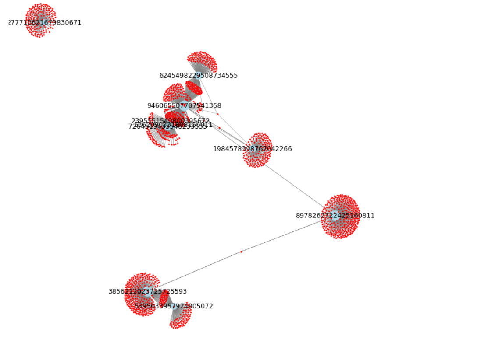

# Using Apache Spark for NLP, Log mining, Stock and Graph tasks

## Decription:

In this project, we've used Apache Spark for NLP, Log mining, and Stock and Graph tasks.

## Spark for NLP
For this task, we first counted and displayed the number of words in the txt.Input file. We also reported how often each word was repeated and saved the output to a .txt file. In this step, all punctuation marks (exclamation marks, question marks, periods, etc.) were removed. Finally, we created the `bigram` of the prepared data frame and compute the count of each bigram.

## LogFile Mining with Spark
The log file of this exercise is called Log, which is related to HTTP requests. This file was explored using the basic commands of Spark, SQL Spark, or Dataframes Spark.

## Stock Market Analysis using Spark
In this task, the 6-month stock market data of the Iran Stock Exchange was used. We downloaded daily stock market data for a two-month period that can have at least thirty distinct days. First, with the help of Spark, we opened the files and added the day, month, and year columns to them. (a date column).
In this task, the questions were answered with Spark and with two different approaches (Dataframe Spark / SQL Spark).

## Spark GraphX
The graphs in question are extracted from [Wikipedia](https://www.wikipedia.org/) articles in this task. Each node is a Wikipedia article and an edge from article A to article B indicates that article A referred to article B.

